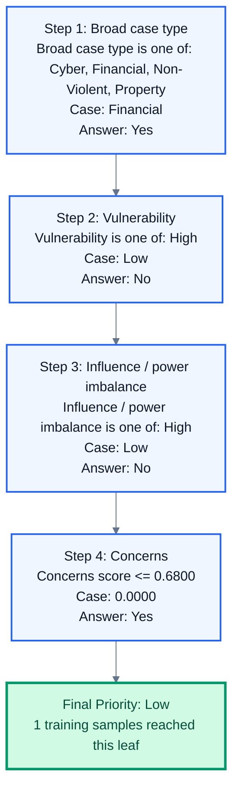

# Decision Tree Priority Report

  
Low Priority

  <h2>A_K_Kaimal_vs_Sudarsen_Trading_Co_Ltd_And_Anr_on_1_January_1800.PDF</h2>
  
A.K. Kaimal filed a petition to be declared insolvent due to his inability to pay debts to Sudarsen Trading Co. Ltd. and another party. The District Judge initially dismissed the petition because the appellant could not account for his retirement funds. The appellate court overturned this decision, ruling that the court should only check if essential legal conditions for insolvency are met at the start.

  

    
Legal Category<strong>Insolvency/Debt</strong>

    
Model Category<strong>Financial</strong>

    
Severity<strong>No Injury</strong>

    
Vulnerability<strong>Low</strong>

    
Influence<strong>Low</strong>

  

## Flow View

## Animated Step View

  
1

  

    
Step 1: Broad case type

    
Broad case type is one of: Cyber, Financial, Non-Violent, Property

    
Case value: <strong>Financial</strong> | Result: <strong>Yes</strong>

  

  
2

  

    
Step 2: Vulnerability

    
Vulnerability is one of: High

    
Case value: <strong>Low</strong> | Result: <strong>No</strong>

  

  
3

  

    
Step 3: Influence / power imbalance

    
Influence / power imbalance is one of: High

    
Case value: <strong>Low</strong> | Result: <strong>No</strong>

  

  
4

  

    
Step 4: Concerns

    
Concerns score <= 0.6800

    
Case value: <strong>0.0000</strong> | Result: <strong>Yes</strong>

  

  
5

  

    
Final Priority: Low

    
The case reached this Decision Tree leaf.

    
Case value: <strong>1 training samples reached this leaf</strong> | Result: <strong>Low</strong>

  

## Decision Trace

Node 0: Broad case type is one of: Cyber, Financial, Non-Violent, Property; case value = Financial; result = Yes -> Node 1: Vulnerability is one of: High; case value = Low; result = No -> Node 3: Influence / power imbalance is one of: High; case value = Low; result = No -> Node 5: Concerns score <= 0.6800; case value = 0.0000; result = Yes -> Leaf node 6 => Predicted Priority = Low

## Raw Graph

Raw DOT file: `case_priority_system/decision_graphs\A_K_Kaimal_vs_Sudarsen_Trading_Co_Ltd_And_Anr_on_1_January_1800_decision_path.dot`
