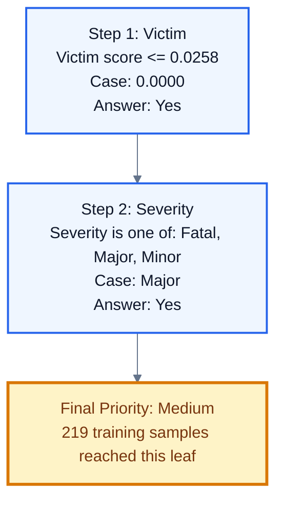

# Decision Tree Priority Report

  
Medium Priority

  <h2>Fictional_Case_Report_Test.pdf</h2>
  
Two unidentified males committed an armed robbery at a convenience store, stealing $18,500 and merchandise. During the crime, the store manager, Emma Carter, was severely assaulted with a crowbar and hospitalized in the ICU. Law enforcement is currently investigating the case using CCTV footage and forensic evidence to apprehend the suspects.

  

    
Legal Category<strong>Criminal/Violent</strong>

    
Model Category<strong>Violent</strong>

    
Severity<strong>Major</strong>

    
Vulnerability<strong>High</strong>

    
Influence<strong>Low</strong>

  

## Flow View

## Animated Step View

  
1

  

    
Step 1: Victim

    
Victim score <= 0.0258

    
Case value: <strong>0.0000</strong> | Result: <strong>Yes</strong>

  

  
2

  

    
Step 2: Severity

    
Severity is one of: Fatal, Major, Minor

    
Case value: <strong>Major</strong> | Result: <strong>Yes</strong>

  

  
3

  

    
Final Priority: Medium

    
The case reached this Decision Tree leaf.

    
Case value: <strong>219 training samples reached this leaf</strong> | Result: <strong>Medium</strong>

  

## Decision Trace

Node 0: Victim score <= 0.0258; case value = 0.0000; result = Yes -> Node 1: Severity is one of: Fatal, Major, Minor; case value = Major; result = Yes -> Leaf node 2 => Predicted Priority = Medium

## Raw Graph

Raw DOT file: `case_priority_system/decision_graphs\Fictional_Case_Report_Test_decision_path.dot`
